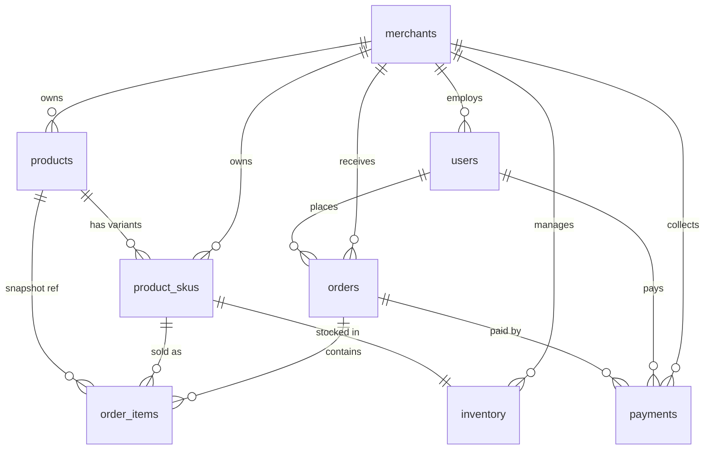

# 数据库表关系说明

## ER 关系图



## 核心设计原则

### 多商户 (merchant_id)

| 表 | merchant_id 作用 |
|----|------------------|
| `merchants` | 商户主表，平台入驻主体 |
| `users` | 可空；商户员工/管理员绑定商户，买家与平台管理员为 NULL |
| `products` | 必填；SPU 归属商户 |
| `product_skus` | 必填；冗余字段，支持按商户维度快速查询 SKU |
| `inventory` | 必填；库存按商户 + 仓库隔离 |
| `orders` | 必填；**一订单一商户**（购物车拆单模型） |
| `order_items` | 必填；冗余，便于商户报表统计 |
| `payments` | 必填；支付流水归属商户 |

> **拆单策略**：买家一次结算可产生多个 `orders`（按 `merchant_id` 拆分），每个订单独立支付、发货。

### 多币种 (currency)

| 表 | 币种字段 | 说明 |
|----|----------|------|
| `merchants.default_currency` | 商户默认结算币种 | 如 USD / EUR |
| `product_skus.currency` | SKU 定价币种 | 跨境场景下不同 SKU 可不同币种 |
| `orders.currency` | 订单结算币种 | 下单时锁定，与 SKU 币种一致或经汇率转换 |
| `orders.exchange_rate` | 下单汇率快照 | 相对基准币（如 USD）的汇率，用于财务对账 |
| `order_items.currency` | 行项目币种快照 | 防止后续 SKU 改价/改币种影响历史订单 |
| `payments.currency` | 实际支付币种 | 可与订单币种相同，跨境支付时记录实际扣款币种 |
| `payments.exchange_rate` | 支付汇率快照 | 支付网关实际使用的汇率 |

### 软删除 (deleted_at)

所有业务表统一使用 `deleted_at DATETIME(3) NULL`：

- `NULL` = 有效记录
- 非 `NULL` = 已软删除

**查询规范**：所有业务查询必须带 `WHERE deleted_at IS NULL`。

唯一索引设计采用 `(business_key, deleted_at)` 组合，允许多条历史软删记录共存。

---

## 表级关系详解

### 1. merchants → users（1:N）

```
merchants.id ← users.merchant_id (nullable)
```

- 一个商户可有多个员工账号（`merchant_admin` / `merchant_staff`）
- 买家 (`customer`) 和平台管理员 (`platform_admin`) 的 `merchant_id` 为 NULL

### 2. merchants → products → product_skus（1:N:N）

```
merchants.id ← products.merchant_id
products.id  ← product_skus.product_id
merchants.id ← product_skus.merchant_id (冗余)
```

- **SPU/SKU 分离**：`products` 存商品共性信息，`product_skus` 存规格与价格
- `spec_values` JSON 存规格键值，如 `{"color":"Red","size":"M"}`
- `spec_text` 用于列表展示，避免每次解析 JSON

### 3. product_skus → inventory（1:1 或 1:N）

```
product_skus.id ← inventory.product_sku_id
merchants.id    ← inventory.merchant_id
```

- 默认单仓库模型：`warehouse_code = 'DEFAULT'`
- 扩展多仓库：同一 SKU 在不同仓库各一条 inventory 记录
- 库存三态：`total_qty = available_qty + locked_qty`

### 4. users → orders → order_items（1:N:N）

```
users.id      ← orders.user_id
merchants.id  ← orders.merchant_id
orders.id     ← order_items.order_id
```

- 订单明细冗余 `product_name / sku_code / spec_text / image_url` 作为**交易快照**
- 即使 SPU/SKU 后续修改或下架，历史订单数据不受影响

### 5. orders → payments（1:N）

```
orders.id ← payments.order_id
```

- 支持一笔订单多次支付尝试（失败重试）
- 支持部分退款产生多条 payment 记录（扩展时可加 `payment_type: pay/refund`）
- `third_party_trade_no` 关联 Stripe/PayPal 等外部流水

---

## 订单状态流转

```
pending → paid → processing → shipped → delivered → completed
   ↓         ↓                                    ↓
cancelled  refunding → refunded
```

| 字段 | 独立状态轴 |
|------|-----------|
| `orders.status` | 订单主状态 |
| `orders.payment_status` | 支付状态 |
| `orders.shipping_status` | 物流状态 |

三轴独立设计，避免组合爆炸（如「已支付但未发货」= `payment_status=paid` + `shipping_status=unshipped`）。

---

## 库存并发控制

`inventory.version` 字段用于乐观锁：

```sql
UPDATE inventory
SET available_qty = available_qty - :qty,
    locked_qty    = locked_qty + :qty,
    version       = version + 1
WHERE product_sku_id = :sku_id
  AND available_qty >= :qty
  AND version = :current_version
  AND deleted_at IS NULL;
```

下单锁库存 → 支付成功扣减 `locked_qty` 并减少 `total_qty` → 取消/超时释放 `locked_qty`。
